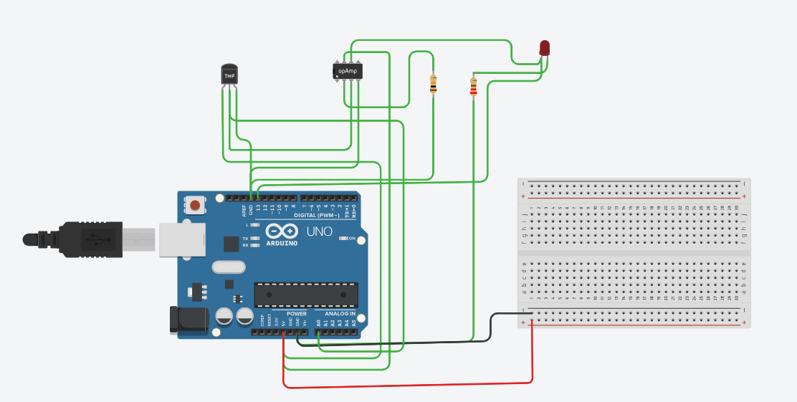

# Temperature Monitoring System Using Arduino and Op-Amp 741

## 💡 Overview
This project is a simple temperature monitoring system using an Arduino UNO, a TMP36 temperature sensor, and an Op-Amp 741. The system lights up an LED when the temperature exceeds 30°C.

## 🛠️ Tools Used
- **Arduino UNO** (Simulated on Tinkercad)
- **TMP36 Temperature Sensor**
- **Op-Amp 741**
- **LED**
- **220Ω Resistor**
- **Tinkercad** (Open-source tool)

## ⚡ Circuit Diagram



## 📜 Features
- Reads temperature from the TMP36 sensor
- Stabilizes sensor output using Op-Amp 741
- Displays LED alert when temperature > 30°C
- Uses Arduino Pin D13 to control LED

## 🧩 Components and Connections
1. **TMP36 Temperature Sensor:**
   - Pin 1 (Vcc): Connect to 5V of Arduino
   - Pin 2 (Output): Connect to Op-Amp Pin 3 (Non-Inverting Input)
   - Pin 3 (GND): Connect to GND of Arduino

2. **Op-Amp 741:**
   - Pin 2 (Inverting Input): Connect to GND
   - Pin 3 (Non-Inverting Input): Connect to TMP36 Output
   - Pin 4 (V-): Connect to Arduino GND
   - Pin 6 (Output): Connect to Arduino A0
   - Pin 7 (V+): Connect to Arduino 5V

3. **LED:**
   - Anode (Long Leg): Connect to Arduino Pin D13
   - Cathode (Short Leg): Connect to 220Ω Resistor → Arduino GND


## 🚀 How to Simulate
1. Open [Tinkercad](https://www.tinkercad.com/)
2. Import Arduino UNO, TMP36, Op-Amp 741, and LED
3. Connect components as shown above
4. Copy the Arduino code into Tinkercad Code Editor
5. Click **Start Simulation** and adjust the TMP36 temperature slider
   


## 📦 Folder Structure
```
Temperature-Monitoring-System
├── README.md
├── Code
│   └── temperature_monitoring.ino
└── Images
    └── circuit_diagram.png
```

## ⚖️ License
This project is open-source and free to use for educational purposes.

## ❤️ Credits
- Developed by **Sonali Mohanta**
- Simulated using **Tinkercad**
